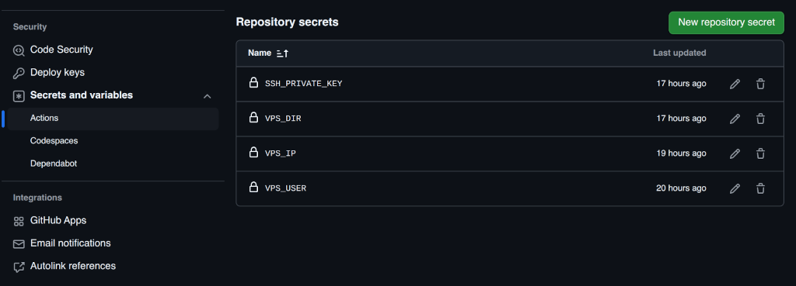
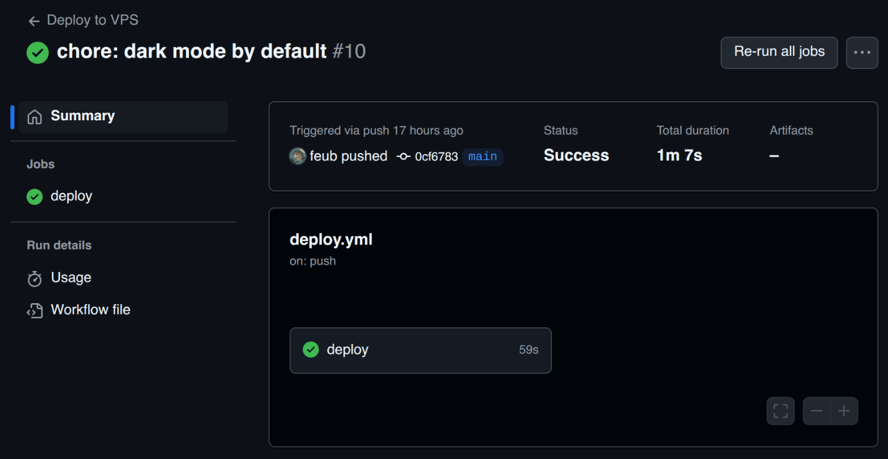

# Pipeline CD avec GitHub Actions sur un VPS

Voyons comment mettre en place un pipeline simple de **déploiement** pour un projet NodeJS (ce site [Docusaurus](https://https://docusaurus.io/) sur un VPS, ici chez [OVH](https://www.ovhcloud.com/fr/vps/).

## Pré-requis

Ce document explique la mise en place du déploiement uniquement, et non de l'installation du serveur. On estime qu'il y a déjà un serveur web (Nginx, Apache, Caddy, etc) fonctionnel, qui sert déjà le site en question. On va juste ajouter le déploiement automatique.

Voici donc ce qu'il faut pour mettre en place ce pipeline :

- Un serveur avec un accès SSH (VPS, serveur dédié)
- Un site ou une application NodeJS
- Un dépôt Git pour le site est question
- Être à l'aise avec le Terminal, il faut juste quelques notions de Bash

## Création d'une paire de clés SSH pour GitHub Actions

Afin que GitHub Actions puisse se connecter au serveur VPS automatiquement - sans mot de passe - il faut générer une paire de clés SSH dédiée. Pour se faire, il faut se connecter au VPS et générer les clés de la manière suivante :

```sh
ssh-keygen -t ed25519 -f github_actions_key -C "github-actions-deploy"
```

Ne pas mettre de passphrase pour une connection automatique. On sécurisera la clé privée en la limitant à cet usage et en la stockant de manière sécurisée.

Les clés sont générées et se trouvent dans le répertoire `~/.ssh/` :

```sh
~/.ssh/github_actions_key
~/.ssh/github_actions_key.pub
```

Maintenant, il faut ajouter la clé publique au fichier `authorized_keys` :

```sh
# Copier le contenu de github_actions_key.pub dans authorized_keys
cat github_actions_key.pub >> ~/.ssh/authorized_keys

# Changer les permissions du fichier authorized_keys
chmod 600 ~/.ssh/authorized_keys
```

## Ajouter la clé privée à GitHub Secrets

On va commencer par copier le contenu de la clé privée :

```sh
# Copier tout le contenu de github_actions_key, y compris les lignes BEGIN/END
cat github_actions_key
```

Il faut maintenant ajouter la clé privée à GitHub. Se rendre sur le dépot GitHub, dans sa configuration, aller dans _Secrets and variables > Actions > Repository secrets_ et ajouter la clé dans `SSH_PRIVATE_KEY` :



On en profite pour ajouter d'autres secrets qui nous serviront pour **GitHub Workflows** :

```
VPS_IP      # L'adresse IP du serveur
VPS_USER    # L'utilisateur SSH
VPS_DIR     # Le répertoire vers où déployer le site
```

### Tester la connexion

On peut maintenant tester la connexion au VPS :

```sh
ssh -i github_actions_key <utilisateur>@<ip-du-serveur>
```

Remplacer `<utilisateur>` et `<ip-du-serveur>` par les bonnes valeurs.

Si la connexion échoue, vérifier que les clés ont correctement été copiées, ainsi que les droits sur les fichiers (600).

Egalement, vérifier que la configuration du serveur SSH (`sshd_config`) autorise l'authentification par clé publique. Cette ligne doit exister (et n'être pas commentée) :

```
PubkeyAuthentication yes
```

## Configurer GitHub Actions

Dernière étape, la configuration GitHub Actions pour le déploiement automatique.

### Créer le fichier de workflow

Dans le projet local :

- Ajouter un répertoire `.github/workflows`. Celui-ci contiendra tout ce qui est relatif à GitHub Actions (CI/CD).
- Ajouter un fichier `deploy.yml` dans ce répertoire avec ce contenu :

```yaml
name: Deploy to VPS

on:
  push:
    branches:
      - main

jobs:
  deploy:
    runs-on: ubuntu-latest

    steps:
      - name: Checkout code
        uses: actions/checkout@v3

      - name: Setup Node.js
        uses: actions/setup-node@v3
        with:
          node-version: 22

      - name: Install dependencies
        run: npm install

      - name: Build site
        run: npm run build

      - name: Deploy files to VPS
        uses: appleboy/scp-action@master
        with:
          host: ${{ secrets.VPS_IP }}
          username: ${{ secrets.VPS_USER }}
          key: ${{ secrets.SSH_PRIVATE_KEY }}
          source: "./build/"
          target: "${{ secrets.VPS_DIR }}"
          strip_components: 1
```

### Description du workflow

Ce workflow GitHub Actions est conçu pour déployer un site ou une application sur un serveur privé virtuel (VPS) chaque fois qu'un changement est poussé sur la branche principale (main). Voici une description détaillée de chaque section et étape du workflow :

1. **Nom du workflow** :
   name: Deploy to VPS : Ce champ donne un nom au workflow.

2. **Déclencheur du workflow** :
   on: push: branches: - main : Ce workflow est déclenché automatiquement à chaque push sur la branche main.

3. **Définition des jobs** :
   jobs: deploy: : Définit un job nommé deploy. Ce job contient toutes les étapes nécessaires pour déployer l'application.

4. **Environnement d'exécution** :
   runs-on: ubuntu-latest : Indique que le job s'exécute sur la dernière version d'Ubuntu fournie par GitHub Actions.

5. **Étapes du job** :

   - _Checkout code_ :
     uses: actions/checkout@v3 : Utilise l'action checkout pour cloner le dépôt de code sur l'environnement d'exécution.

   - _Setup Node.js_ :
     uses: actions/setup-node@v3 : Configure l'environnement Node.js.
     with: node-version: 22 : Spécifie la version de Node.js à utiliser (ici, la version 22).

   - _Install dependencies_ :
     run: npm install : Exécute la commande npm install pour installer les dépendances du projet définies dans le fichier package.json.

   - _Build site_ :
     run: npm run build : Exécute le script de build défini dans le package.json pour générer les fichiers de production du site ou de l'application.

   - _Deploy files to VPS_ :
     uses: appleboy/scp-action@master : Utilise l'action scp-action pour copier les fichiers générés vers le VPS via SCP (Secure Copy Protocol).
     with: : Fournit les paramètres nécessaires pour la connexion SCP :
     - host : L'adresse IP du VPS, stockée dans les secrets GitHub.
     - username : Le nom d'utilisateur pour se connecter au VPS, stocké dans les secrets GitHub.
     - key : La clé SSH privée pour l'authentification, stockée dans les secrets GitHub.
     - source : Le répertoire local contenant les fichiers à copier (généralement le dossier de build).
     - target : Le répertoire cible sur le VPS où les fichiers seront copiés, stocké dans les secrets GitHub.
     - strip_components: 1 : Option pour enlever le composant de base du chemin source lors de la copie.

Ce workflow automatise le processus de déploiement, assurant que chaque mise à jour sur la branche principale est immédiatement déployée sur le serveur de production.

## Déclencher le workflow

Une fois le fichier de workflow configuré, il est ajouté au dépôt Git et poussé vers GitHub :

```
git add .github/workflows/deploy.yml
git commit -m "Added GitHub Actions workflow for deployment"
git push origin main
```

Le workflow se déclenche lorsqu'un commit est poussé sur la branche main. Le déploiement est réussi :


